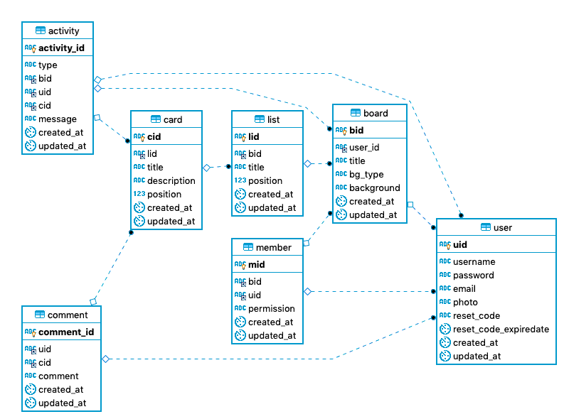

# Work Flow( API )   
This is an API server for Work Flow. Development was done using `Node.js` with `express`.

### Features  
* User management
* Board CRUD
* List CRUD
* Card CRUD
* Comment function
* Activity logging function

### Feature Implementation

- [x] Model definition
- [x] Controller definition
- [x] Route definition
- [x] User - Login / Sign up
- [x] User - Change password
- [x] User - Forgot password
- [x] Board - Retrieve board
- [x] Board - Update board
- [x] Board - Delete board
- [x] Board - Create board
- [x] Board - Change background color
- [x] Board - Member list
- [x] Board - Add member
- [x] Board - Remove member
- [x] List - Retrieve list
- [x] List - Create list
- [x] List - Delete list
- [x] List - Edit list title
- [x] List - Move list
- [x] Card - Retrieve card
- [x] Card - Create card
- [x] Card - Delete card
- [x] Card - Edit card
- [x] Card - Move card
- [x] Comment - Retrieve comment
- [x] Comment - Create comment
- [x] Comment - Edit comment
- [x] Comment - Delete comment
- [x] Activity - Log events
- [x] Activity - Retrieve event logs

### ER Diagram



### Model

**User**

```javascript
{
  uid: {
    field: "uid",
    type: DataTypes.UUID,
    defaultValue: DataTypes.UUIDV4,
    primaryKey: true,
    allowNull: false
  },
  username: {
    field: "username",
    type: DataTypes.STRING(10),
    allowNull: false,
  },
  password: {
    field: "password",
    type: DataTypes.STRING(100),
    allowNull: false
  },
  email: {
    field: "email",
    type: DataTypes.STRING(50),
    allowNull: false,
  },
  photo: {
    field: "photo",
    type: DataTypes.STRING(20),
    allowNull: false
  },
  reset_code: {
    field: "reset_code",
    type: DataTypes.UUID,
    allowNull: true
  },
  reset_code_expiredate: {
    field: "reset_code_expiredate",
    type: DataTypes.DATE,
    allowNull: true
  }
}
```

**Board**

```javascript
{
  bid: {
    field: "bid",
    type: DataTypes.UUID,
    defaultValue: DataTypes.UUIDV4,
    primaryKey: true,
    allowNull: false
  },
  user_id: {
    field: "user_id",
    type: DataTypes.UUID,
    allowNull: false,
  },
  title: {
    field: "title",
    type: DataTypes.STRING(30),
    allowNull: false
  },
  bg_type: {
    field: "bg_type",
    type: DataTypes.ENUM,
    values: ['image', 'color'],
    defaultValue: 'color',
    allowNull: false
  },
  background: {
    field: "background",
    type: DataTypes.STRING(100),
    defaultValue: 'rgb(0, 121, 191)',
    allowNull: false
  }
}
```

**List**

```javascript
{
  lid: {
    field: "lid",
    type: DataTypes.UUID,
    defaultValue: DataTypes.UUIDV4,
    primaryKey: true,
    allowNull: false
  },
  bid: {
    field: "bid",
    type: DataTypes.UUID,
    allowNull: false,
  },
  title: {
    field: "title",
    type: DataTypes.STRING(30),
    allowNull: false
  },
  position: {
    field: "position",
    type: DataTypes.DOUBLE,
    allowNull: false,
    defaultValue: 65535
  }
}
```

**Card**

```javascript
{
  cid: {
    field: "cid",
    type: DataTypes.UUID,
    defaultValue: DataTypes.UUIDV4,
    primaryKey: true,
    allowNull: false
  },
  lid: {
    field: "lid",
    type: DataTypes.UUID,
    allowNull: false,
  },
  title: {
    field: "title",
    type: DataTypes.STRING(30),
    allowNull: false
  },
  description: {
    field: "description",
    type: DataTypes.STRING(500),
    allowNull: true
  },
  position: {
    field: "position",
    type: DataTypes.DOUBLE,
    allowNull: false,
    defaultValue: 65535
  }
}
```

**Comment**  

```javascript
{
  comment_id: {
    field: "comment_id",
    type: DataTypes.UUID,
    defaultValue: DataTypes.UUIDV4,
    primaryKey: true,
    allowNull: false
  },
  uid: {
    field: "uid",
    type: DataTypes.UUID,
    allowNull: false,
  },
  cid: {
    field: "cid",
    type: DataTypes.UUID,
    allowNull: false
  },
  comment: {
    field: "comment",
    type: DataTypes.STRING(50),
    allowNull: false
  }
}
```

**Activity**

```javascript
{
  activity_id: {
    field: "activity_id",
    type: DataTypes.UUID,
    defaultValue: DataTypes.UUIDV4,
    primaryKey: true,
    allowNull: false
  },
  type: {
    field: "type",
    type: DataTypes.ENUM,
    values: ['move', 'add', 'delete', 'edit', 'comment'],
    allowNull: false,
  },
  bid: {
    field: "bid",
    type: DataTypes.UUID,
    allowNull: false,
  },
  uid: {
    field: "uid",
    type: DataTypes.UUID,
    allowNull: false
  },
  cid: {
    field: "cid",
    type: DataTypes.UUID,
    allowNull: true
  },
  message: {
    field: "message",
    type: DataTypes.STRING(300),
    allowNull: false,
  }
}
```